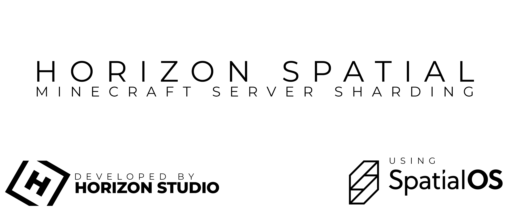
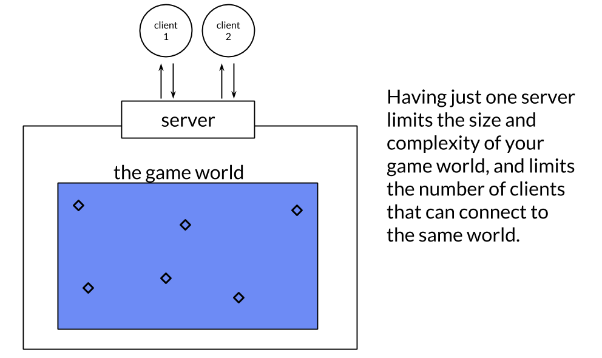
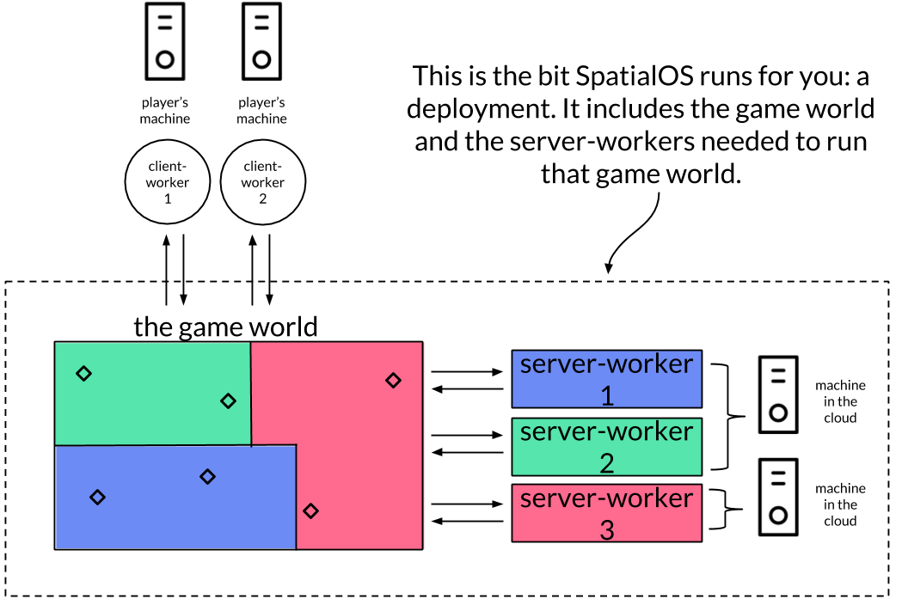

# Horizon Spatial

## What is it?
Spatial is a project which aims to completely replace minecraft's networking internals with SpatialOS to allow infinite worlds with near infinite people.

## How does it work?

The traditional ways to develop large online games mean that you’re either limited by the capacity of a single game server, or you have to shard your game world.

SpatialOS works differently: it brings together many servers so they’re working as one. But it does this in a way that makes a single world which looks seamless to players.

